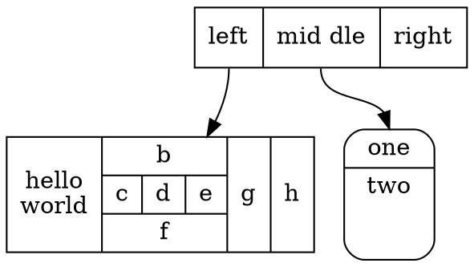
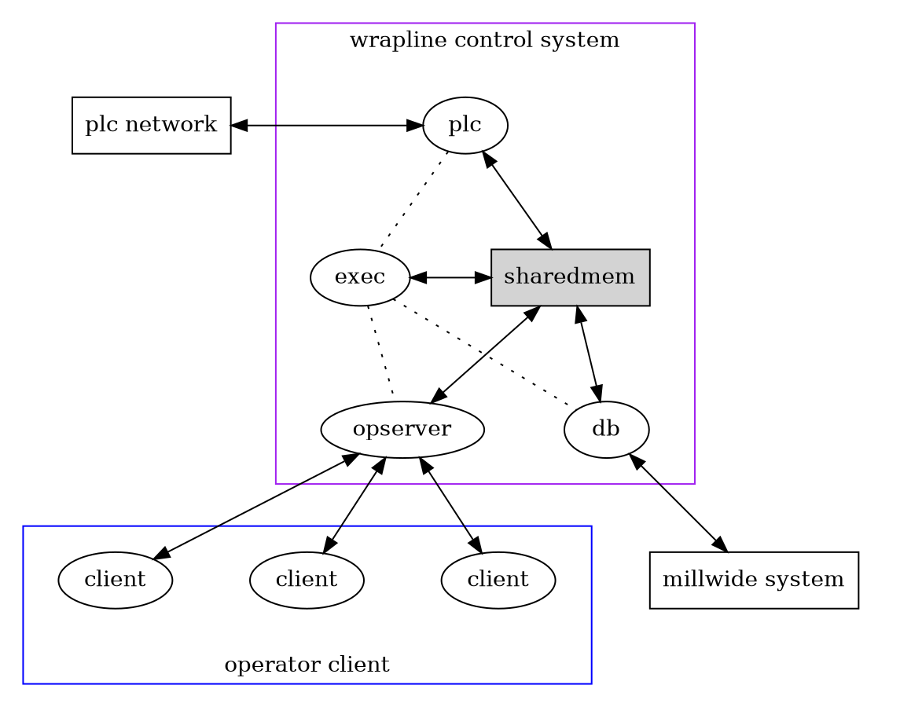
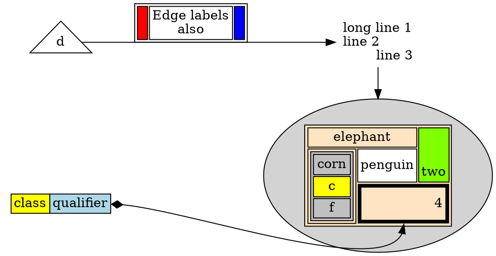

## Dot 生成图的默认命令 

`dot -T<type> -o <outfile> <infile.dot>`

dot 可以替换为circo等其他算法，详细见[命令的选择](#命令的选择)章节。

输入文件是 **<infile.dot>** ，生成的格式由 **<type>** 指定，生成的文件是 **<outfile>** 。其中 **-T<type>** 包括：

```shell
-Tps (PostScript)
-Tsvg -Tsvgz (Structured Vector Graphics)
-Tfig (XFIG  graphics)
-Tmif  (FrameMaker graphics)
-Thpgl (HP pen plotters)
-Tpcl (Laserjet printers)
-Tpng -Tgif (bitmap graphics)
-Tdia (GTK+ based diagrams)
-Timap (imagemap files for httpd servers for each node or edge  that  has a non-null "href" attribute.)
-Tcmapx (client-side imagemap for use in html and xhtml)
```


## rank 

rank 约束了子图的节点位置，有向图中，一个箭头的指向，带有级别，一般是尾端高于尖端，即 `a->b` a 的级别要高于 b 的级别。

same : 所有节点在同一级别的节点处

min : 所有节点在最小级别节点处

source : 所有节点在最低级别，且只有子图属性为 **source** 或者 **min** 的时候，才能使用同样的级别

max : 类似于 **source**

sink : 类似于 **source**

> **NOTE:** 最低级别，可以是 **最上** 、 **最下** 、 **最左** 、 **最右**

## rankdir 

- TB : top-to-bottom
- LR : left-to-right
- BT : bottom-to-top
- RL : right-to-left


## dot 线条 

```dot
splines = ortho #直角拆线
splines = spline #曲线（不遮挡）
splines = cuvved #曲线（可遮挡）
splines = line #直线（可遮挡）
splines = polyline #直线（不遮挡）
```


## 命令的选择 

| 命令  | 介绍                             |
|-------|----------------------------------|
| dot   | 渲染图具有明确的方向性           |
| neato | 图缺乏方向性                     |
| twopi | 图采用放射性布局                 |
| circo | 图采用环形布局                   |
| fdp   | 图缺乏方向性                     |
| sfdp  | 用来渲染大型图，且图片缺乏方向性 |


## 静默执行代码 

```emacs-lisp
(setq org-confirm-babel-evaluate nil) ;;执行静默语句块
```

## dot 实例 

- 绘制流程图:










